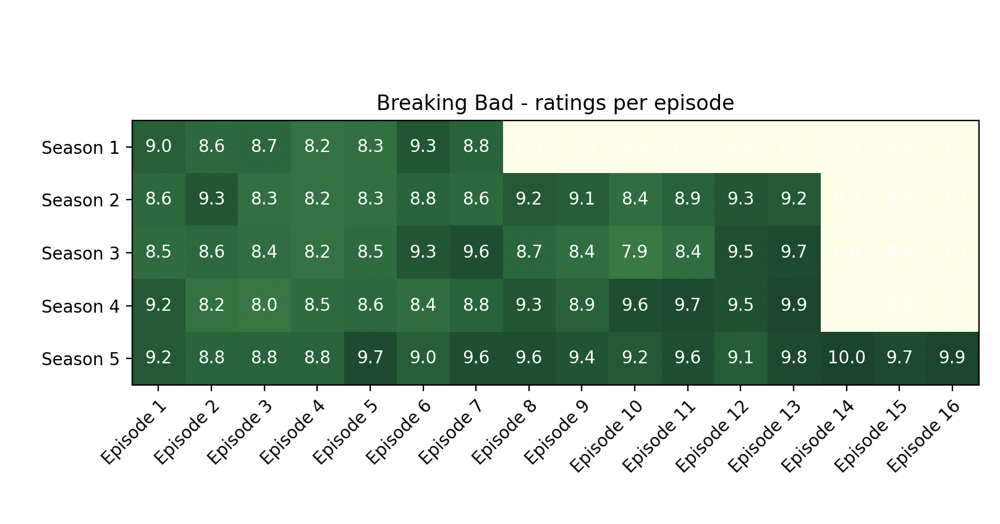

## Breaking Bad TV Show 📺 - Episodes Heatmap

### Short description

Scraping Breaking Bad's ratings for each episode (using python's package _beautiful soup_) and creating the corresponding heatmap (using _numpy_ and _matplotlib_)

---

### Technologies used

<table>
  <tr>
    <td valign="top"></td>
    <td valign="top"></td>
    <td valign="top"></td>
  </tr>
</table>

---

### Goals ✅

- practice **scraping** online data and using it to create some sort of **visual representation**

---

### Key learnings 🔑

- how to create a heatmap using matplotlib
- how to use bs4 to scrape static data

---

### Run the file

```python
# In the command line interface, run the following command to start the app

python3 main.py
```

---

### Heatmap (result)

## 

### Credits

- Author: Bruno Campos
